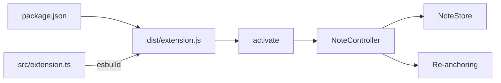

# Commenter Development Guide

This document explains how Commenter is structured, built, activated, and tested.

## Entry Points

Commenter has a source entry point and a packaged runtime entry point:

- Source: [`src/extension.ts`](../src/extension.ts)
- Runtime bundle: `dist/extension.js`

The extension manifest in [`package.json`](../package.json) declares `dist/extension.js` as `main`. [`esbuild.mjs`](../esbuild.mjs) starts at `src/extension.ts` and bundles its runtime dependencies into that file while leaving the VS Code API external.



## Activation

[`src/extension.ts`](../src/extension.ts) is intentionally small. Its exported `activate()` function:

1. Creates a `NoteController`.
2. Adds it to `context.subscriptions` for cleanup.
3. Calls `initialize()` to load existing workspace notes.

VS Code activates Commenter when a contributed command such as `commenter.createNote` is invoked. The manifest also declares `workspaceContains:**/.commenter/notes.json`, allowing existing shared notes to be restored when a repository opens.

## Extension Manifest

[`package.json`](../package.json) defines the extension's public contract:

- Extension identity and supported VS Code version.
- Runtime bundle under `main`.
- Commands for creating, submitting, editing, deleting, and reattaching notes.
- Default keyboard shortcuts.
- Native comment menu placement and visibility conditions.
- The `commenter.authorName` setting.
- Build, test, and packaging scripts.

The internal comment commands are hidden from the Command Palette and appear only in the appropriate native comment controls.

## Main Controller

[`src/comments/noteController.ts`](../src/comments/noteController.ts) is the central coordinator between VS Code, storage, and anchoring.

Its constructor:

- Creates a native `CommentController`.
- Configures the multiline input prompt.
- Registers all commands.
- Subscribes to document-open, document-save, file-rename, and workspace-folder events.
- Supplies an empty commenting range list, which enables command-created comment input without showing add-comment controls on every line.

The controller maintains:

- One `NoteStore` per workspace folder.
- Bindings between persisted note IDs and native comment threads.
- A set of unsaved draft threads.
- VS Code subscriptions that are disposed when the extension stops.

## Creating a Note

The `commenter.createNote` command follows this path:

1. Read the active text editor.
2. Confirm that the file belongs to an open workspace folder.
3. Use the selected range, or the full current line when the selection is empty.
4. Create an empty native `CommentThread` at that range.
5. Expand the thread so its multiline editor is visible.
6. Wait for the user to save or cancel.

When the user submits the note, the controller:

1. Validates the body.
2. Reads `commenter.authorName`, prompting when it is empty.
3. Generates a UUID for the note.
4. Stores the selected text and surrounding context.
5. Builds a `StoredNote` record.
6. Persists the record through `NoteStore`.
7. Replaces the draft with a collapsed saved thread.

## Native Comment Model

[`src/comments/noteComment.ts`](../src/comments/noteComment.ts) adapts stored note data to VS Code's `Comment` interface. It provides:

- A Markdown body.
- Author and timestamp information.
- Preview and editing modes.
- A reference to the parent thread.
- The previous body for cancelling an edit.
- A stale label when the original code cannot be found.

Markdown is marked as untrusted and embedded HTML is disabled.

## Persisted Data Model

[`src/model/note.ts`](../src/model/note.ts) defines and validates the shared JSON format. Each note contains:

```text
id
filePath
range
anchor text
lines before and after the anchor
body
author
createdAt
updatedAt
status: active | stale
```

The parser validates the schema version, normalized ranges, dates, unique IDs, relative paths, and required strings. Serialization sorts notes by path, position, and ID to keep Git diffs deterministic.

## Shared Storage

[`src/storage/noteStore.ts`](../src/storage/noteStore.ts) owns `.commenter/notes.json` for one workspace folder.

It:

- Indexes notes by ID in memory.
- Uses `vscode.workspace.fs` for local, remote, and virtual workspaces.
- Serializes writes through a promise queue.
- Writes to `notes.json.tmp` and then replaces the destination.
- Watches external create, change, and delete events.
- Avoids reprocessing its own equivalent write event.
- Keeps the last valid in-memory state if external JSON is malformed.

Store changes emit an event. `NoteController` responds by reconciling the corresponding native comment threads.

## Re-Anchoring

[`src/anchors/reanchor.ts`](../src/anchors/reanchor.ts) contains pure TypeScript text-matching logic and has no VS Code dependency.

When a note is created, `captureAnchor()` stores the exact selected text and up to two lines before and after it. When a document opens, `reanchor()`:

1. Checks whether the stored range and context still match.
2. Searches for exact copies of the anchored text.
3. Accepts a unique match.
4. Scores duplicate matches using surrounding lines.
5. Marks the note stale when no candidate can be selected safely.

A stale note remains available in the Comments panel but has no editor range, preventing it from pointing at unrelated code. It can later be attached to a new selection with `commenter.reattachNote`.

## Workspace Lifecycle

The controller creates a separate store for every workspace folder. It also:

- Adds and removes stores when workspace folders change.
- Updates stored relative paths when files are renamed inside the same workspace folder.
- Validates anchors when relevant documents open.
- Refreshes active anchor fingerprints when documents are saved.
- Rejects untitled files and files outside an open workspace folder.

## Build Pipeline

[`tsconfig.json`](../tsconfig.json) enables strict TypeScript checks and emits testable JavaScript into `out`. [`esbuild.mjs`](../esbuild.mjs) creates the smaller production bundle in `dist`.

Useful commands are:

```bash
npm run check
npm run test:unit
npm run test:integration
npm run build
npm run package
```

The generated VSIX includes the manifest, README, and production bundle. Source files, test output, development dependencies, and downloaded test versions of VS Code are excluded by [`.vscodeignore`](../.vscodeignore).

## Testing

The test layers are:

- [`src/test/reanchor.test.ts`](../src/test/reanchor.test.ts): unchanged and shifted ranges, duplicate text, deleted anchors, and empty lines.
- [`src/test/note.test.ts`](../src/test/note.test.ts): schema validation and deterministic serialization.
- [`src/integration/extension.test.ts`](../src/integration/extension.test.ts): activation, command invocation, and real workspace filesystem persistence.
- [`.vscode-test.mjs`](../.vscode-test.mjs): launches the integration suite in an isolated Extension Host using [`test/fixtures/workspace`](../test/fixtures/workspace).

The integration test verifies the command path and persistence boundary. Native comment-widget interactions are also checked manually through the **Run Commenter (Sandbox)** launch configuration.
