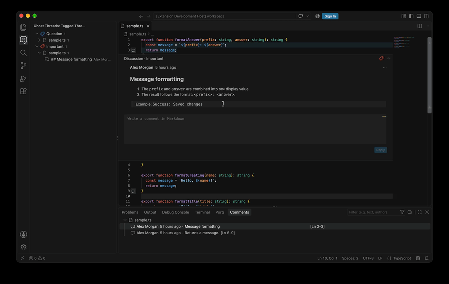
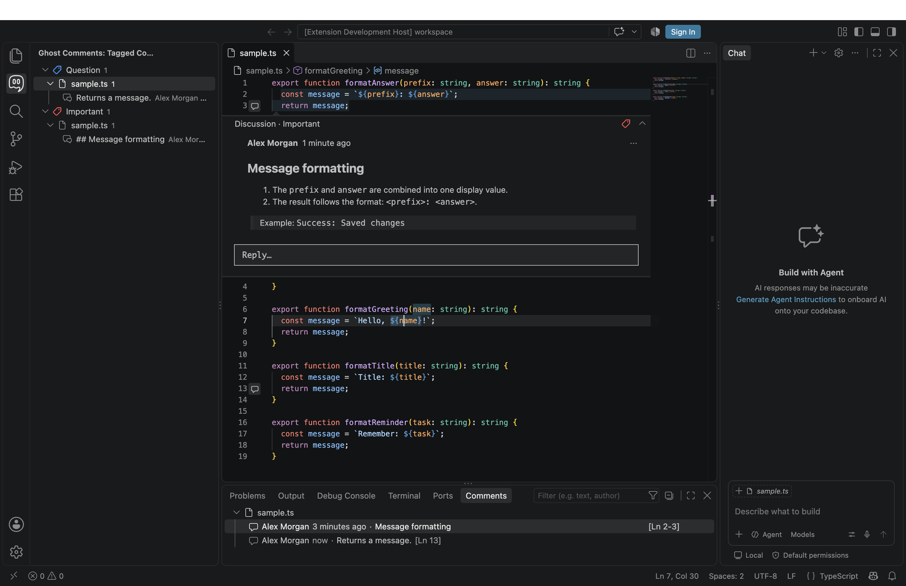
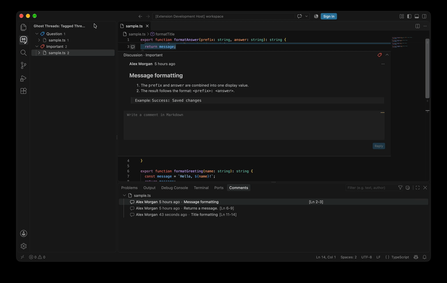

# Ghost Threads

Attach durable, repository-shared discussions to code without adding comment text to source files.





Ghost Threads uses VS Code's native Comments interface. Threads stay anchored to code as it moves, support Markdown replies, and can be organized with colored tags from the Activity Bar.

## Features

- Attach a comment to selected code or an entire line.
- Reply to comments, creating a thread.
- Write multiline Markdown comments and replies in VS Code's native comment editor.
- Share discussions through a deterministic `.gc/comments.json` file in the repository.
- Attach a comment to selected code or an entire line.
- Reply to comments, creating a thread.
- Write multiline Markdown comments and replies in VS Code's native comment editor.
- Share discussions through a deterministic `.gc/comments.json` file in the repository.
- Follow code as lines move, with a safe reattachment flow when an anchor can no longer be found.
- Create and apply colored tags without editing settings JSON.
- Browse discussions by tag, file, thread, and reply from the Tagged Threads sidebar or within the Comments panel.
- Recover from accidental comment-file changes with passive local backup snapshots.

## See it in action

### Create and tag a thread


### Browse existing threads



## Getting Started

1. Select code, or leave the cursor on a line to annotate the whole line.
2. Press `Cmd+Option+N` (`⌘ ⌥ N`) on macOS or `Ctrl+Alt+N` on Windows and Linux.
3. Enter a Markdown comment and choose **Save**.
4. Press `Cmd+Option+N` (`⌘ ⌥ N`) on macOS or `Ctrl+Alt+N` on Windows and Linux.
5. Enter a Markdown comment and choose **Save**.
6. Choose an existing tag, create a new tag, or press Enter on **Untagged**.

> _The first comment prompts for an author name. Change it later with the **Ghost Threads: Author Name** setting. Press `⌘ ⇧ P` (macOS) or Ctrl+Shift+P (Windows/Linux), choose **Preferences: Open Settings (UI)**, then search for **Ghost Threads: Author Name**. Existing discussions keep their original authors._

Saved comments appear through VS Code's gutter indicator and Comments panel. Use the comment actions to edit, reply, delete, reattach, or change the discussion tag.
Saved comments appear through VS Code's gutter indicator and Comments panel. Use the comment actions to edit, reply, delete, reattach, or change the discussion tag.

### Change the shortcut

To change the shortcut, press `⌘ ⇧ P` (macOS) or Ctrl+Shift+P (Windows/Linux), choose **Preferences: Open Keyboard Shortcuts**, search for **Ghost Threads: Create Note**, and assign another shortcut. User keybindings override the packaged default.

> By default it is `Cmd+Option+N` (`⌘ ⌥ N`) on macOS or `Ctrl+Alt+N` on Windows and Linux.

## Tags and Sidebar

The tag picker starts with **Untagged**, followed by configured tags and **Create New Tag…**. Creating a tag asks for a name and one of seven colors, saves the definition to workspace settings, and applies it immediately.


Open the Ghost Threads Activity Bar view to browse discussions by **tag → file → comment → replies**. Selecting a comment or reply opens its file and expands the native discussion. Detached discussions open the file without selecting an unsafe range.

The default tags are To Do, Question, Important, and Done. Advanced changes such as renaming, recoloring, reordering, or removing definitions are available through `ghostThreads.tags` in workspace settings:

```json
"ghostThreads.tags": [
  { "id": "todo", "label": "To Do", "color": "orange" },
  { "id": "question", "label": "Question", "color": "blue" },
  { "id": "important", "label": "Important", "color": "red" },
  { "id": "question", "label": "Question", "color": "blue" },
  { "id": "important", "label": "Important", "color": "red" },
  { "id": "done", "label": "Done", "color": "green" }
]
```

Supported colors are `red`, `orange`, `yellow`, `green`, `blue`, `purple`, and `gray`. Keep an ID unchanged when renaming or recoloring a tag because comments store the ID. Removing a definition preserves existing assignments under a gray `Unknown: <id>` group.
Supported colors are `red`, `orange`, `yellow`, `green`, `blue`, `purple`, and `gray`. Keep an ID unchanged when renaming or recoloring a tag because comments store the ID. Removing a definition preserves existing assignments under a gray `Unknown: <id>` group.

## Shared Storage and Backups

Each workspace folder stores discussions in `.gc/comments.json`. Commit this file when discussions should be shared with the repository team. Ghost Threads watches it for changes from editors and Git operations. Existing `.gc/comments.json` files and their backups are moved to the new names when first opened.

A passive recovery snapshot is stored at `.gc/comments-backup.json`. The first saved change creates it, and the **Ghost Threads: Backup Interval** setting controls later updates. Set the interval to `0` to disable backups.

Backups are never restored automatically. To recover, preserve or remove a damaged `comments.json`, copy `comments-backup.json` to `comments.json`, and run **Developer: Reload Window**. A backup can trail the primary file by the configured interval.
Backups are never restored automatically. To recover, preserve or remove a damaged `comments.json`, copy `comments-backup.json` to `comments.json`, and run **Developer: Reload Window**. A backup can trail the primary file by the configured interval.

## Moving and Reattaching Code

Ghost Threads stores the original range and nearby text. When a file opens, it validates the original location and searches for a unique contextual match if the code moved.

If no safe match exists, the discussion becomes detached. Choose **Reattach comment**, select a new location in the same workspace folder, and choose **Attach here**. Cancelling leaves the discussion detached. File renames within one workspace folder update comment paths automatically.
If no safe match exists, the discussion becomes detached. Choose **Reattach comment**, select a new location in the same workspace folder, and choose **Attach here**. Cancelling leaves the discussion detached. File renames within one workspace folder update comment paths automatically.

## Settings

| Setting                       | Purpose                                                    | Default             |
| ----------------------------- | ---------------------------------------------------------- | ------------------- |
| `ghostThreads.authorName`     | Author stored with new comments and replies                | Prompt on first use |
| `ghostThreads.backupInterval` | Saved changes between backup updates; `0` disables backups | `10`                |
| `ghostThreads.tags`           | Ordered tag definitions and colors                         | Four built-in tags  |

## Requirements and Limitations

- VS Code 1.138 or later.
- Comments must be attached to files inside an open workspace folder.
- Comments must be attached to files inside an open workspace folder.
- Moving files between workspace folders does not move discussions automatically.
- Ghost Threads does not provide resolved state, cloud synchronization, authentication, or a webview.
- Teams sharing `.gc/comments.json` should use a reply-capable Ghost Threads version before editing discussions.

## Privacy

Ghost Threads contains no telemetry, analytics, advertising, authentication, or cloud service. The extension does not send comment text, source code, author names, or workspace data over the network. Discussions remain in the workspace's `.gc` directory; settings are stored through VS Code and may follow the user's VS Code Settings Sync preferences.

## Support

Report bugs and request features through [GitHub Issues](https://github.com/Luzzu-Studios/ghost-threads/issues). Include the extension version, VS Code version, operating system, reproduction steps, and sanitized error details. See [SUPPORT.md](SUPPORT.md) for guidance.

## License

Ghost Threads is available under the [MIT License](LICENSE).
